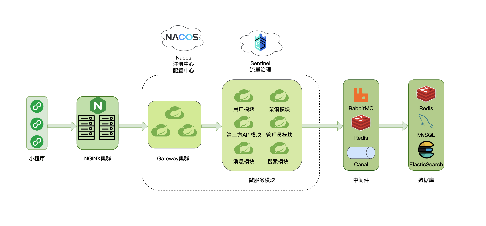

# ”烹烹“—PPeng

烹烹（PPeng）是一款菜谱微信小程序应用，旨在为用户提供一个平台，让他们能够分享自己的菜谱创意，同时获得他人分享的菜谱和专业的烹饪学习教程。该应用通过社区互动和专业资源的结合，为用户带来丰富的烹饪体验和灵感。

#### 本项目仅包含后端的所有内容！！！

## 系统要求

为了确保烹烹（PPeng）应用后端的正常运行，建议至少使用一台配置为`8核8G`的服务器或服务器集群。

ps: `4核4G`被完全干爆，最终使用了`16核8G`的服务器才完全启动😭，下图是**没有任何请求进入时**的服务器性能使用情况：

## 技术栈

### 前端

- 框架

  `uni-app`

- UI库

  `vantui`

- 图标库

  `iconfont`

### 后端

- 主体框架 

  `Spring Boot`,`Spring Cloud`,`Spring Cloud Alibaba`

- 微服务相关

  - 服务注册与发现,配置中心: `Nacos`
  - 服务网关: `Spring Cloud Gateway`
  - 熔断与限流: `Sentinel`
  - 远程调用: `Spring Cloud OpenFeign`

- 数据库相关

  - 数据库: `MySQL`
  - 数据库连接池: `Druid`
  - 数据库框架: `MyBatis-Plus`
  - 全文检索: `ElasticSearch`

- 缓存相关

  - 分布式缓存: `Redis`
  - 本地缓存: `Caffeine`
  - 缓存同步: `Canal`

- 其他

  - 鉴权框架: `Sa-Token`
  - 工具包: `Hutool`
  - 内容审核和菜品识别: [`百度API`](https://ai.baidu.com/)
  - 消息队列: `RabbitMQ`

## 架构概述

### 架构图

### 架构说明

PPeng是一个采用前后端分离的系统，其架构设计采用了微服务架构。下面是对该架构的简要说明：

1. 前后端分离

   PPeng将前端和后端解耦，前端负责用户界面的呈现和交互，后端则提供数据和业务逻辑处理。这种架构能够提高系统的灵活性和可扩展性，并支持多端（如Web、移动端等）的访问。

2. 后端微服务架构

   PPeng的后端采用了微服务架构，将系统拆分为多个独立的微服务模块，每个模块专注于特定的功能。这种方式使得系统更易于维护、部署和扩展，同时允许团队使用不同的技术栈来开发和维护各个微服务。

3. Nginx负载均衡和反向代理

   前端发送的请求首先经过Nginx的负载均衡器，该组件能够将请求分发到多个后端服务实例，以提高系统的吞吐量和可用性。同时，Nginx还充当反向代理，将请求转发到后端服务网关。

4. 网关

   后端服务网关是整个系统的入口，负责接收前端请求并进行统一的用户认证、请求过滤和路由转发。它可以提供安全性、访问控制、限流等功能，并将请求转发到相应的微服务实例。

5. 多级缓存

   通过引入Redis和Caffeine作为多级缓存，以及使用Canal进行缓存同步，PPeng能够在提供高性能和低延迟的同时，保持数据的一致性和可靠性。缓存系统的使用减轻了后端数据库的压力，并显著提升了系统的整体性能和用户体验。

### 业务模块说明

#### 用户模块

- 用户注册

  允许用户通过提供用户名、密码和电子邮件地址进行注册。验证用户输入的信息，并在成功注册后将其保存到数据库中。

- 用户登录

  允许已注册用户使用其凭据登录系统。验证用户提供的用户名和密码，并在成功登录后提供访问令牌。

- 保存、更新、删除用户相关数据

  允许用户保存、更新和删除个人信息，如用户名、密码、电子邮件地址、个人简介等。

- 保存点赞或收藏的菜谱

  允许用户将喜欢的菜谱标记为点赞或收藏。

- 关注的人

  允许用户关注其他用户。

#### 菜谱模块

- 菜谱上传

  允许用户上传自己的菜谱，包括菜谱名称、食材、步骤和图片等信息。将菜谱保存到数据库中，并关联到用户的账户。

- 菜谱更新和删除

  允许用户更新已上传的菜谱信息，如修改菜谱名称、食材或步骤等。同时，用户也可以删除自己上传的菜谱。

- 菜谱类型获取

  提供菜谱类型的获取接口，允许用户根据不同的分类或标签浏览和搜索菜谱。

- 菜谱评论功能

  允许用户对菜谱进行评论和评分。用户可以查看他人的评论，并对其进行回复。

#### 第三方 API 模块

- 邮件发送服务

  通过调用邮件发送服务的 API，向用户发送注册、密码重置或验证邮件。

- 内容审核 API

  调用百度内容审核 API 对用户个人信息和菜谱内容进行审核，以确保不包含违规或敏感信息。

- 菜品识别 API

  当用户上传的菜谱包含未知菜品时，调用百度菜品识别 API 对菜谱中的菜品进行识别，提供相应的菜品信息和图片。

#### 管理员模块

- 审核菜谱内容

  管理员可以查看用户举报的菜谱内容，并对其进行审核，以判断是否违规。如果菜谱内容确实违规，管理员可以删除或下架相应菜谱。

- 处理用户申述

  管理员可以处理用户提出的申述，如对处罚或审核结果的异议。管理员需仔细审查相关信息，并采取适当的行动。

#### 消息模块

- 违规警告

  当用户的行为违反规定时，系统可以向用户发送警告消息，提醒其注意并采取相应的纠正措施。

- 菜谱审核通过通知

  用户上传的菜谱通过审核时，系统可以向用户发送通知消息，告知其菜谱已可在平台上显示。

#### 搜索模块

- 菜谱全文检索服务

  提供全文检索功能，允许用户根据关键词搜索菜谱名称、食材或其他相关信息，以便快速找到所需的菜谱。

## 部署

详情见[部署教程](./部署教程.md)

该教程详细解释了如何使用docker对项目环境进行安装和配置，对项目进行打包盒部署

## API文档

详情见[API文档](./API文档.md)
