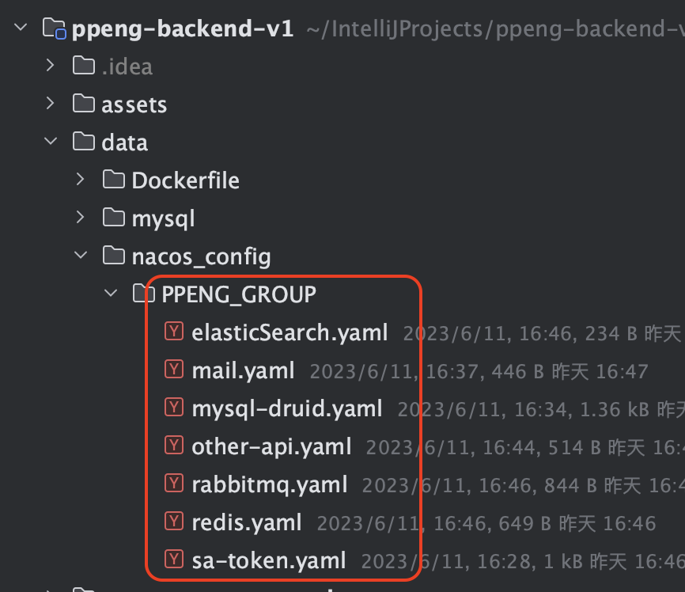
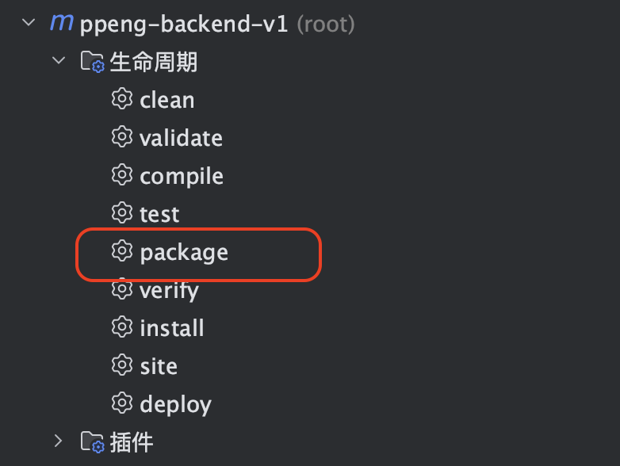
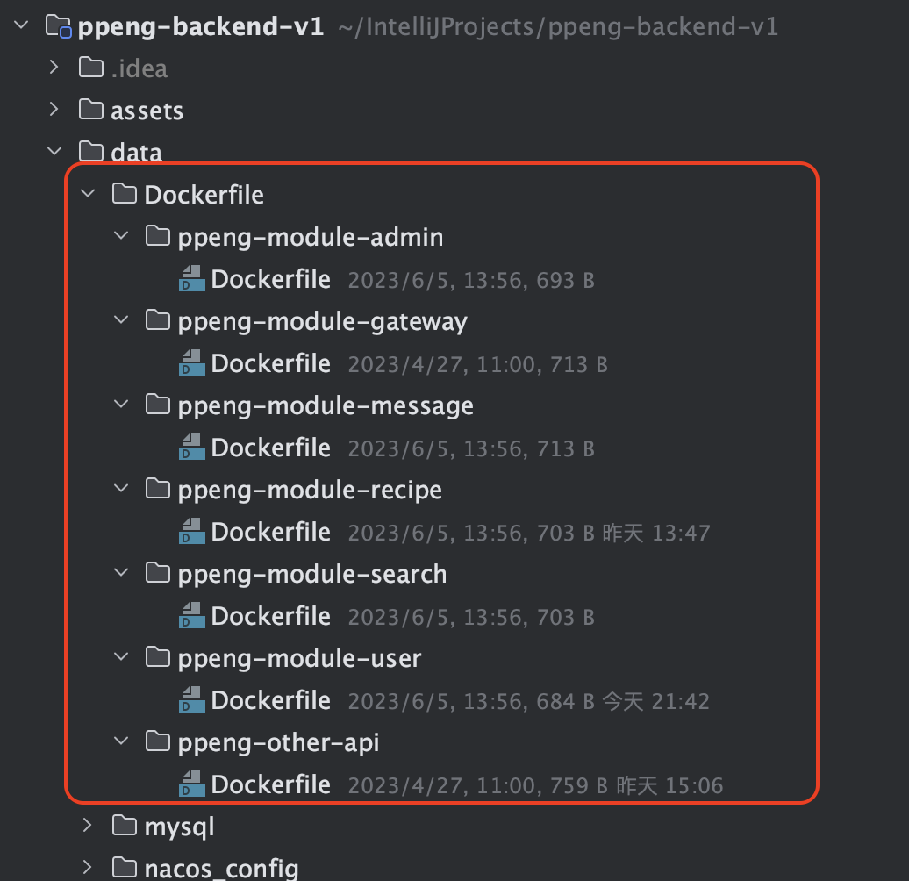

# ”烹烹“-PPeng 

# 后端部署教程

> 下面所有环境的配置安装，以及项目的部署都将使用docker(除了nginx和sentinel)，请确保服务器上已经安装了docker
- [”烹烹“-PPeng](#烹烹-ppeng)
- [后端部署教程](#后端部署教程)
    - [创建docker网络](#创建docker网络)
    - [redis:6.2.6](#redis626)
      - [docker 安装命令](#docker-安装命令)
      - [设置临时密码](#设置临时密码)
    - [rabbitmq:3-management](#rabbitmq3-management)
      - [docker 安装命令](#docker-安装命令-1)
    - [mysql 8.0.32](#mysql-8032)
      - [my.cnf](#mycnf)
      - [docker 安装命令](#docker-安装命令-2)
      - [初始化数据库](#初始化数据库)
    - [ElasticSearch:8.5.2](#elasticsearch852)
      - [docker 安装命令](#docker-安装命令-3)
      - [重新设置密码](#重新设置密码)
      - [设置ES索引的映射](#设置es索引的映射)
    - [nacos v2.2.0](#nacos-v220)
      - [docker 安装命令](#docker-安装命令-4)
      - [初始化nacos](#初始化nacos)
    - [canal:latest](#canallatest)
      - [docker 安装命令](#docker-安装命令-5)
      - [编辑配置文件](#编辑配置文件)
    - [sentinel:1.8.6](#sentinel186)
      - [运行命令](#运行命令)
    - [Nginx:1.18.0](#nginx1180)
      - [相关配置](#相关配置)
  - [项目打包及部署](#项目打包及部署)
    - [修改配置文件](#修改配置文件)
    - [修改参数](#修改参数)
    - [打包成jar](#打包成jar)
    - [打包成docker镜像](#打包成docker镜像)
    - [例子](#例子)


项目运行环境配置

> 所配置的环境包括：
>
> - redis
> - rabbitmq
> - mysql
> - elasticsearch
> - nacos
> - canal
> - sentinel
> - nginx


### 创建docker网络

```sh
docker network create ppeng_net
```


### redis:6.2.6 

#### docker 安装命令

```sh
docker run -d --network ppeng_net \
-p 6379:6379 \
--privileged=true \
-v /home/redis/data:/data \
--name=redis redis:6.2.6
```

#### 设置临时密码

> ps:设置永久密码通过redis配置文件设置

```sh
# 进入redis容器
docker exec -it redis bash
# 连接redis
redis-cli
# 设置密码
config set requirepass redis密码
```


### rabbitmq:3-management  

> `rabbitmq:3-management` 版本号中有带`management`的是拥有图形化管理面板的
>
> 下列参数请自行设置
>
> - `RABBITMQ_DEFAULT_PASS` 为默认用户的密码

#### docker 安装命令

```sh
docker run -d  --network ppeng_net \
-p 15672:15672 \
-p 5672:5672 \
--name rabbitmq \
-e RABBITMQ_DEFAULT_USER=ppeng \
-e RABBITMQ_DEFAULT_PASS=默认用户密码 rabbitmq:3-management
```


### mysql 8.0.32

#### my.cnf

[my.cnf](./data/mysql/my.cnf) =>请将`my.cnf`放置到`/home/mysql/conf/`文件夹下

ps: 如果你想要放置到其他位置，请修改下列的docker命令中数据卷挂载位置

#### docker 安装命令

> 下列参数请自行设置
>
> - `MYSQL_ROOT_PASSWORD` mysql密码

```sh
docker run -d --network ppeng_net \
-p 3306:3306 \
--privileged=true \
-v /home/mysql/log:/var/log/mysql \
-v /home/mysql/data:/var/lib/mysql \
-v /home/mysql/conf/my.cnf:/etc/mysql/my.cnf \
-e MYSQL_ROOT_PASSWORD=mysql密码 --name=mysql mysql:8.0.32
```


#### 初始化数据库

- 初始化`db_ppeng`数据库

  [db_ppeng.sql](./data/mysql/db_ppeng.sql) => 在创建`db_ppeng`数据库后执行该文件

- 初始化`db_nacos`数据库

  [db_nacos.sql](./data/mysql/db_nacos.sql) => 在创建`db_nacos`数据库后执行该文件

- 创建用户

  > 下列参数请自行设置
  >
  > - nacos用户密码
  > - canal用户密码

  ```sql
  /*
      配置nacos用户
   */
  CREATE DATABASE IF NOT EXISTS db_nacos;
  
  -- 创建名为 nacos的用户，插件为 mysql_native_password(针对mysql 8+)
  CREATE USER 'nacos'@'%' IDENTIFIED WITH mysql_native_password BY 'nacos用户密码';
  
  -- 授权 nacos 用户访问 db_nacos 数据库
  GRANT ALL PRIVILEGES ON db_nacos.* TO 'nacos'@'%';
  
  /*
    配置canal用户
   */
  CREATE DATABASE IF NOT EXISTS db_ppeng;
  
  -- 创建名为 canal 的用户，插件为 mysql_native_password(针对mysql 8+)
  CREATE USER 'canal'@'%' IDENTIFIED WITH mysql_native_password BY 'canal用户密码';
  
  -- 授权 canal 用户
  GRANT SELECT, REPLICATION SLAVE, REPLICATION CLIENT, SHOW VIEW ON *.* TO `canal`@`%`
  ```

  


### ElasticSearch:8.5.2

#### docker 安装命令

> 由于设置了`xpack.security.http.ssl.enabled=false`
>
> ----取消https连接，所以ES密码无法直接显示在控制台，因此需要重新设置密码

```sh
docker run --name es --network ppeng_net \
-p 9200:9200 -p 9300:9300 \
-e "discovery.type=single-node" \
-e "ES_JAVA_OPTS=-Xms512m -Xmx512m" \
-e "xpack.security.http.ssl.enabled=false" \
-v /home/es/plugins:/usr/share/elasticsearch/plugins \
-d elasticsearch:8.5.2
```

#### 重新设置密码

进入ES容器

```sh
docker exec -it es bash
```

执行重新设置密码命令

> auto - 使用随机生成的密码
> interactive - 使用用户输入的密码

```sh
./bin/elasticsearch-setup-passwords auto
```


#### 设置ES索引的映射

```json
PUT /recipe
{
  "mappings": {
    "properties": {
      "combind": {
        "type": "text",
        "analyzer": "ik_max_word",
        "search_analyzer": "ik_smart"
      },
      "id": {
        "type": "long"
      },
      "userId": {
        "type": "long"
      },
      "typeId": {
        "type": "integer"
      },
      "title": {
        "type": "text",
        "analyzer": "ik_max_word",
        "search_analyzer": "ik_smart",
        "copy_to": "combind"
      },
      "material": {
        "type": "text"
      },
      "content": {
        "type": "text",
        "analyzer": "ik_max_word",
        "search_analyzer": "ik_smart",
        "copy_to": "combind"
      },
      "mediaUrl": {
        "type": "text"
      },
      "isVideo": {
        "type": "integer"
      },
      "isProfessional": {
        "type": "integer"
      },
      "likes": {
        "type": "integer"
      },
      "collections": {
        "type": "integer"
      },
      "createTime": {
        "type": "date"
      },
      "updateTime": {
        "type": "date"
      }
    }
  }
}

```


### nacos v2.2.0  

#### docker 安装命令

> 下列参数请自行设置
>
> - `MYSQL_SERVICE_HOST` mysql的IP地址，在同一docker网络下，填容器名即可
> - `MYSQL_SERVICE_PASSWORD` 上面设置的nacos用户密码

```sh
docker run --name nacos -d --network ppeng_net \
-p 7744:8848 \
-p 8744:9848 \
-p 8745:9849 \
--privileged=true \
--restart=always \
-e MODE=standalone \
-e PREFER_HOST_MODE=hostname \
-e SPRING_DATASOURCE_PLATFORM=mysql \
-e MYSQL_SERVICE_HOST=mysql \
-e MYSQL_SERVICE_DB_NAME=db_nacos \
-e MYSQL_SERVICE_PORT=3306 \
-e MYSQL_SERVICE_USER=nacos \
-e MYSQL_SERVICE_PASSWORD=nacos用户密码 \
-e TIME_ZONE='Asia/Shanghai' \
-v /home/nacos/logs:/home/nacos/logs \
nacos/nacos-server:v2.2.0
```

#### 初始化nacos

1. 进入nacos控制台，默认用户名为`ppeng`，默认密码为`nacos`。

2. 点击命名空间，创建新的命名空间

   

3. 修改`./data/nacos_config/PPENG_GROUP`中的配置文件，补充所有有`TODO`标识的内容

   目录结构如下：

   

   例如：`elasticSearch.yaml`文件

   ```yaml
   spring:
     elasticsearch:
       uris: es:9200           #TODO 换成你的ElasticSearch地址，在同一docker网络下，填写容器名:默认端口即可
       username: elastic
       password:       #TODO 换成你的Elastic用户密码
   ```

4. 将`PPENG_GROUP`文件夹压缩，点击nacos控制台中的`配置管理`,进入`配置列表`，选择`PPeng`命名空间，然后 导入配置

   > 注意：导入的是`PPENG_GROUP.zip`

   


### canal:latest

#### docker 安装命令

> 下列参数请自行设置
>
> - `canal.instance.master.address` mysql的IP地址以及端口，在同一docker网络下，填容器名即可
> - `canal.instance.dbPassword` 上面设置的canal用户密码

```sh
docker run -d --network ppeng_net \
-p 11111:11111  \
-e canal.destinations=db_ppeng \
-e canal.instance.master.address=mysql:3306  \
-e canal.instance.dbUsername=canal  \
-e canal.instance.dbPassword=canal用户密码  \
-e canal.instance.connectionCharset=UTF-8 \
-e canal.instance.tsdb.enable=true \
-e canal.instance.gtidon=false  \
-e canal.instance.filter.regex=db_ppeng\\..* \
--name canal canal/canal-server
```

#### 编辑配置文件

进入canal容器内部

```sh
docker exec -it canal bash
```


编辑`canal.properties`文件

```sh
vi /home/admin/canal-server/conf/canal.properties
```

修改下列位置：

> 下列参数请自行设置
>
> - `rabbitmq.host` rabbitMQ的IP地址，在同一docker网络下，填容器名即可
> - `rabbitmq.password` 上面设置的RabbitMQ默认用户密码

```properties
# 选择RabbitMQ模式
canal.serverMode = rabbitMQ
##################################################
#########                   RabbitMQ         #############
##################################################
rabbitmq.host =rabbitmq
rabbitmq.virtual.host =/
rabbitmq.exchange =ppeng.topic.exchange
rabbitmq.username =ppeng
rabbitmq.password =默认用户密码
rabbitmq.deliveryMode =topic
```


编辑`instance.properties`文件

```sh
vi /home/admin/canal-server/conf/db_ppeng/instance.properties
```

修改下列位置：

```properties
canal.mq.topic=canal.data
```

重启容器：

```sh
docker restart canal
```


再次进入容器查看

```sh
cat /home/admin/canal-server/logs/db_ppeng/db_ppeng.log
```

出现以下提示即为成功：

```bash
2023-05-17 18:20:44.786 [destination = db_ppeng , address = mysql/172.18.0.2:3306 , EventParser] WARN  c.a.o.c.p.inbound.mysql.rds.RdsBinlogEventParserProxy - ---> begin to find start position, it will be long time for reset or first position
2023-05-17 18:20:44.786 [destination = db_ppeng , address = mysql/172.18.0.2:3306 , EventParser] WARN  c.a.o.c.p.inbound.mysql.rds.RdsBinlogEventParserProxy - prepare to find start position just show master status
2023-05-17 18:20:45.224 [destination = db_ppeng , address = mysql/172.18.0.2:3306 , EventParser] WARN  c.a.o.c.p.inbound.mysql.rds.RdsBinlogEventParserProxy - ---> find start position successfully, EntryPosition[included=false,journalName=mysql-bin.000005,position=4,serverId=1000,gtid=<null>,timestamp=1684318348000] cost : 417ms , the next step is binlog dump
```


### sentinel:1.8.6

> 下载地址：https://github.com/alibaba/Sentinel/releases/download/1.8.6/sentinel-dashboard-1.8.6.jar
>

#### 运行命令

> 下列参数请自行设置
>
> - `-Dsentinel.dashboard.auth.password` Sentinel密码

```sh
nohup java -Dserver.port=8182 -Dcsp.sentinel.dashboard.server=localhost:8182 -Dproject.name=sentinel-dashboard -Dsentinel.dashboard.auth.username=ppeng -Dsentinel.dashboard.auth.password=Sentinel密码 -jar sentinel-dashboard-1.8.6.jar >temp.log &
```


### Nginx:1.18.0

> 安装过程。。。略

#### 相关配置

> 注意替换自己的域名和SSL证书位置

```nginx
    server {
        listen *:80;
        listen *:443 ssl; 
        listen [::]:80;
        listen [::]:443 ssl;
        server_name www.ppeng.zhub.fun;

        ssl_certificate /etc/letsencrypt/live/ppeng.zhub.fun/fullchain.pem; 
        ssl_certificate_key /etc/letsencrypt/live/ppeng.zhub.fun/privkey.pem; 

        return 301 https://ppeng.zhub.fun$request_uri;
    }

    server {
        listen *:80;
        listen [::]:80;
        server_name ppeng.zhub.fun;
        return 301 https://ppeng.zhub.fun$request_uri;
    }

    server {
        listen *:443 ssl; 
        listen [::]:443 ssl; 
        server_name ppeng.zhub.fun;      
              
        ssl_certificate /etc/letsencrypt/live/ppeng.zhub.fun/fullchain.pem; 
        ssl_certificate_key /etc/letsencrypt/live/ppeng.zhub.fun/privkey.pem; 
  
  			location /v1/api/ {
            default_type  application/json;
            #internal;  
            keepalive_timeout   30s;  
            keepalive_requests  1000;  
            #支持keep-alive  
            proxy_http_version 1.1;  
            rewrite /v1/api(/.*) $1 break;  
            proxy_pass_request_headers on;
            #more_clear_input_headers Accept-Encoding;  
            proxy_next_upstream error timeout;  
	    			client_max_body_size 1024m;
            proxy_pass http://localhost:6378;
        }
  
          location /resource/ {
					client_max_body_size 1024m;
            root "/home/ppeng/";
        }

        location / {
            return 404;
        }
        
    }
```


## 项目打包及部署

> 后端代码将通过Maven进行打包成jar包，然后使用Dockerfile文件打包成相应的docker镜像，实现容器化部署

### 修改配置文件

> 在将项目打包成jar包前，需要修改各个模块中的`application.yml`和`bootstrap.yml`文件，需要修改的参数如下(在相关文件中都有`TODO`标识)：
>
> - nacos 密码（在各个模块的`application.yml`和`bootstrap.yml`中）
> - Sentinel 密码（仅在`ppeng-module-gateway`模块的`application.yml`中）

例如：

在`ppeng-module-user`模块中：

- `application.yml`

  ```yaml
  server:
    port: 3377
  
  
  spring:
    application:
      name: ppeng-module-user
    output:
      ansi:
        enabled: always
    cache:
      type: caffeine
    cloud:
      nacos:
        discovery:
          server-addr: nacos:8848 # TODO 换成你的nacos地址，如果在同一docker网络下，填写容器名：端口号即可
          namespace: ppeng
          group: PPENG_GROUP
          username: ppeng
          password: **confidential**  # TODO 换成你的nacos用户密码
  # 。。。。。。。。。其他略。。。。。。。。。
  ```

- `bootstrap.yml`

  ```yaml
  spring:
    cloud:
      nacos:
        # 配置中心
        config:
          server-addr: nacos:8848 # TODO 换成你的nacos地址，如果在同一docker网络下，填写容器名：端口号即可
          enabled: true
          file-extension: yaml
          group: PPENG_GROUP
          namespace: ppeng
          username: ppeng
          password: **confidential**    # TODO 换成你的nacos用户密码
  # 。。。。。。。。。其他略。。。。。。。。。
  ```

  

### 修改参数

> 除了修改配置文件以外，还需要修改`ppeng-common-api`模块中的一些参数

`fun.zhub.ppeng.constant.SystemConstants`类

```java
/**
 * <p>
 * 系统常量
 * <p>
 *
 * @author Zaki
 * @version 1.0
 * @since 2023-03-18
 **/
public interface SystemConstants {
  /**
  * .........
  */

    /**
     * url  TODO 换成你的域名
     */
    String PPENG_URL = "https://ppeng.zhub.fun/";
  
    /**
  	* .........
  	*/

    /**
     * 接口url  TODO 换成你的接口路径前缀
     */
    String PPENG_API_URL = PPENG_URL + "v1/api";

}

```


### 打包成jar

使用IDEA就能很轻松的使用Maven完成这步操作,需要注意的是：请在在`ppeng-backend-v1`中使用`package`命令




ps:因为各个模块都有引用`ppeng-common-api`公共模块，如果单独打包某一模块，都会出现`ppeng-common-api`不存在的情况


### 打包成docker镜像

在`./data/Dockerfile`文件夹中已经编写好了所有模块的Dockerfile文件，只需要将打包好的jar包和对应的Dockerfile文件放在**同一文件夹**内，即可构建docker镜像.

Dockerfile存放目录如下：



Dockerfile文件：

> 每个`Dockerfile`文件的末尾都包含对应的构建命令和执行命令。

例如：`ppeng-module-user`模块的`Dockerfile`文件如下：

```dockerfile
# ppeng-module-user Dockerfile文件

#################################################################################
############## Dockerfile文件 内容 略。。。。。 ####################################
#################################################################################

# ppeng-module-user 模块的构建命令和运行命令 在这里！！！！！！！！！！！！！！！！！！

# 构建命令
# docker build -t ppeng/user:1.0 .

# 运行命令
# docker run -d -p 3377:3377 --network ppeng_net --restart=always --name ppeng-user -v /home/ppeng/logs/ppeng-user:/root/logs/ppeng-user  ppeng/user:1.0
```


在了解完Dockerfile文件的存放位置和Dockerfile的文件内容后，我们开始构建Docker镜像


1. 上传jar包和Dockerfile

   推荐将jar包和Dockerfile保存在服务器的`/home/ppeng`文件夹中，具体目录结构如下：

   

   ```sh
   root@czkubuntu:/home/ppeng# tree -L 2
   .
   ├── logs
   │   ├── ppeng-admin
   │   ├── ppeng-gateway
   │   ├── ppeng-message
   │   ├── ppeng-other-api
   │   ├── ppeng-recipe
   │   ├── ppeng-search
   │   └── ppeng-user
   ├── ppeng-admin
   │   ├── Dockerfile
   │   └── ppeng-module-admin-1.0-SNAPSHOT.jar
   ├── ppeng-gateway
   │   ├── Dockerfile
   │   └── ppeng-module-gateway-1.0-SNAPSHOT.jar
   ├── ppeng-message
   │   ├── Dockerfile
   │   └── ppeng-module-message-1.0-SNAPSHOT.jar
   ├── ppeng-other-api
   │   ├── Dockerfile
   │   └── ppeng-other-api-1.0-SNAPSHOT.jar
   ├── ppeng-recipe
   │   ├── Dockerfile
   │   └── ppeng-module-recipe-1.0-SNAPSHOT.jar
   ├── ppeng-search
   │   ├── Dockerfile
   │   └── ppeng-module-search-1.0-SNAPSHOT.jar
   ├── ppeng-user
   │   ├── Dockerfile
   │   └── ppeng-module-user-1.0-SNAPSHOT.jar
   └── resource
       ├── icon
       └── recipe
   ```

   目录结构说明：

   - `logs`

     存放各个模块的日志文件

   - `ppeng-admin`

     > 和`ppeng-admin`文件夹相同结构的还有：
     >
     > `ppeng-gateway`,`ppeng-message`,`ppeng-other-api`,`ppeng-recipe`,`ppeng-search`,`ppeng-user` 

     存放`ppeng-admin`模块的jar包和对应的`Dockerfile`文件. 

   - `resource`

     存放静态资源

     - `icon`

       存放用户头像

     - `recipe`存放菜谱图片和菜谱视频

2. 执行构建命令

   > 在执行构建命令前我们需要进入Dockerfile的**同级目录**

   ```sh
   docker build -t ppeng/user:1.0 .
   ```

   ps: 再次提醒每个`Dockerfile`文件的末尾都包含对应的构建命令和执行命令。

3. 执行运行命令

   ```sh
   docker run -d -p 3377:3377 --network ppeng_net --restart=always --name ppeng-user -v /home/ppeng/logs/ppeng-user:/root/logs/ppeng-user  ppeng/user:1.0
   ```

   ps: 再次提醒每个`Dockerfile`文件的末尾都包含对应的构建命令和执行命令。

   


### 例子

> 下面将以`ppeng-module-user`模块为例将其jar包打包成docker镜像，并运行。

- 打包`ppeng-module-user`模块成jar包

  过程略。。。。。。。
  
- 进入`ppeng-module-user`所在的目录

  ```sh
  cd /home/ppeng/ppeng-user
  ```

- 上传文件

  将`ppeng-module-user`打包的jar包(`ppeng-module-user-1.0-SNAPSHOT.jar`)和对应的[Dockerfile](./data/Dockerfile/ppeng-module-user/Dockerfile)文件放在该目录中.

  目录结构如下：

  ```sh
  root@czkubuntu:/home/ppeng/ppeng-user# tree
  .
  ├── Dockerfile
  └── ppeng-module-user-1.0-SNAPSHOT.jar
  ```

- 执行构建命令

  ```sh
  docker build -t ppeng/user:1.0 .
  ```

- 执行运行命令

  ```sh
  docker run -d -p 3377:3377 --network ppeng_net --restart=always --name ppeng-user -v /home/ppeng/logs/ppeng-user:/root/logs/ppeng-user  ppeng/user:1.0
  ```

  

